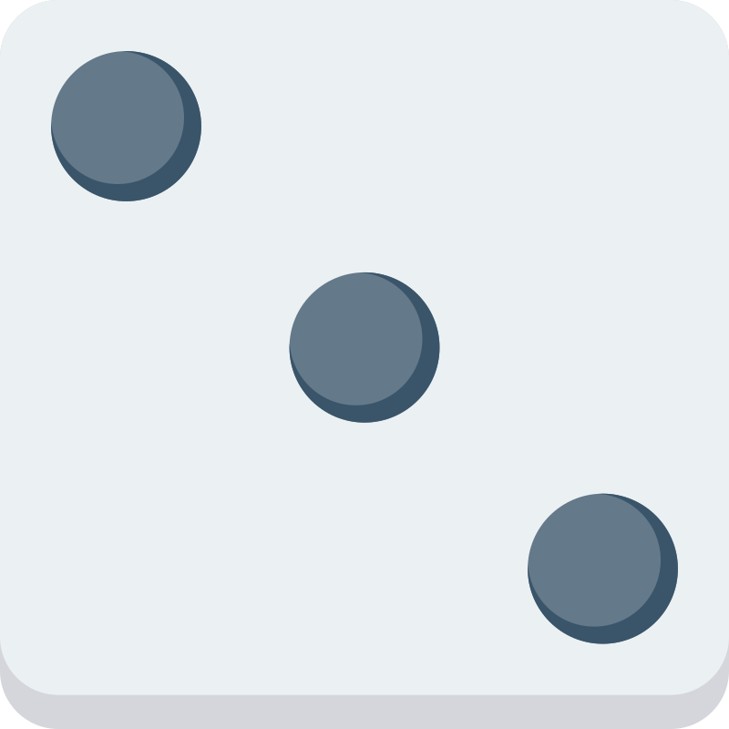

#  PHP Three Dice

This is a php dice game that is player vs computer and each player gets three dices. Player can enter it's name, game rounds and the amount of side it want on the dice 3 - 9.

### Points system
- 1 point if dice roll total >= diceSides * 2.3
  - e.g. diceSides = 6, 1 point if total >= 14
- 2 points if player gets a three of a kind
- 3 points if player gets a straight

### Info
- OOP (object oriented programming) is used for players and dices.
- Player register.
  - Enter name
  - Game rounds.
  - Dice sides.
- Game
  - Current round and total rounds are displayed.
  - Player name, points and three dices are displayed for each player.
  - Roll dice and cancel buttons.
- Game Over
  - Winner  or draw is displayed
  - Score board
  - Return button